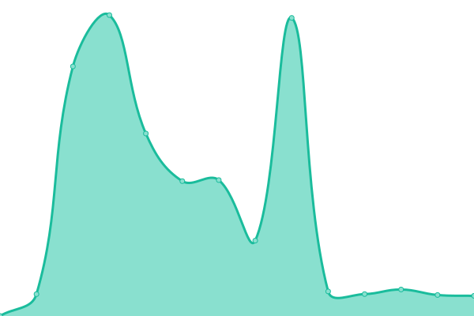

# [📈 Live Status](https://AlignedCookie88.github.io/uptime-monitor): <!--live status--> **🟩 All systems operational**

This repository contains the open-source uptime monitor and status page for [AlignedCookie88](https://alignedcookie88.com), powered by [Upptime](https://github.com/upptime/upptime).

With [Upptime](https://upptime.js.org), you can get your own unlimited and free uptime monitor and status page, powered entirely by a GitHub repository. We use [Issues](https://github.com/AlignedCookie88/uptime-monitor/issues) as incident reports, [Actions](https://github.com/AlignedCookie88/uptime-monitor/actions) as uptime monitors, and [Pages](https://AlignedCookie88.github.io/uptime-monitor) for the status page.

<!--start: status pages-->
<!-- This summary is generated by Upptime (https://github.com/upptime/upptime) -->
<!-- Do not edit this manually, your changes will be overwritten -->
<!-- prettier-ignore -->
| URL | Status | History | Response Time | Uptime |
| --- | ------ | ------- | ------------- | ------ |
|  [AlignedCookie88 Website](https://alignedcookie88.com) | 🟩 Up | [aligned-cookie88-website.yml](https://github.com/AlignedCookie88/uptime-monitor/commits/HEAD/history/aligned-cookie88-website.yml) | 

 1101ms
     
 | 

<a href="https://status.alignedcookie88.com/history/aligned-cookie88-website">99.76%</a>
    

|  [DFAuth](https://dfauth.alignedcookie88.com) | 🟩 Up | [df-auth.yml](https://github.com/AlignedCookie88/uptime-monitor/commits/HEAD/history/df-auth.yml) | 

 1278ms
     
 | 

<a href="https://status.alignedcookie88.com/history/df-auth">99.52%</a>
    

|  [AlignedCookie88 Repositories](https://repo.alignedcookie88.com) | 🟩 Up | [aligned-cookie88-repositories.yml](https://github.com/AlignedCookie88/uptime-monitor/commits/HEAD/history/aligned-cookie88-repositories.yml) | 

 1779ms
     
 | 

<a href="https://status.alignedcookie88.com/history/aligned-cookie88-repositories">45.02%</a>
    

<!--end: status pages-->

[**Visit our status website →**](https://AlignedCookie88.github.io/uptime-monitor)

## 📄 License

- Powered by: [Upptime](https://github.com/upptime/upptime)
- Code: [MIT](./LICENSE) © [Anand Chowdhary](https://anandchowdhary.com), supported by [Pabio](https://pabio.com)
- Data in the `./history` directory: [Open Database License](https://opendatacommons.org/licenses/odbl/1-0/)
